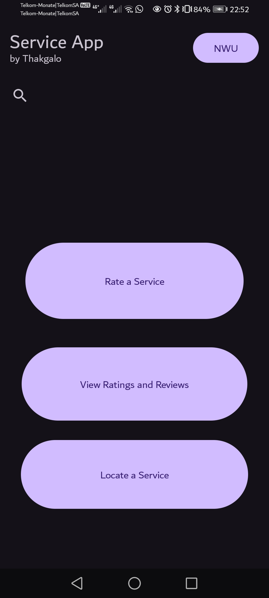
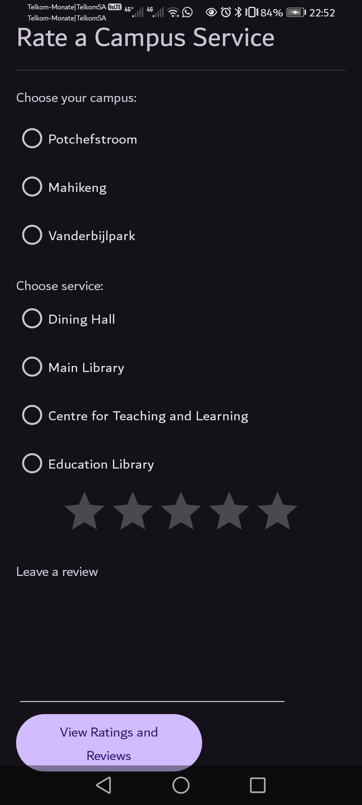

# My First Android App

## Overview

This is my first Android application, created as part of my journey to learn mobile app development. The app demonstrates basic navigation and UI components within the Android framework. While it has several mistakes and areas for improvement, it serves as a foundational project that showcases my learning progress.

## UI OUTPUT


[Download/View My Video]([https://github.com/yourusername/your-repo-name/raw/master/path/to/your-video.mp4](https://github.com/THakgvLO/MyNWUServiceApp/raw/refs/heads/master/video.mp4)

## Features

- **Main Activity**: The main entry point of the app where users can interact with buttons.
- **Fragment Navigation**: Initially designed to navigate to different activities when a button is clicked, the app now uses fragments within the main activity for smoother transitions and better user experience.
- **User Interaction**: Users can click buttons to display different fragments, allowing for dynamic content updates without needing to switch between activities.
- **Rate a Service**: The button when clicked upon by user, it leads to a fragment where they can select the campus service used and give a 5 star rating plus review
- **View Ratings and Reviews**: It should lead to a fragment that allows user to see other students' reviews and ratings
- **Locate Service**: When the button is clicked by user in the main activity, it leads up to a fragment that contains a link or path to the campus map pdf image.
- **NWU**: This is a button that allows the user to open the university's homepage
- **Search bar**: Allows user to search, i.e. "Locate a service"
- **Learning Curve**: I AM HOPING TO WORK MORE ON THE PROJECT TO WORK ON MY SKILLS AND IMPROVE. 

## Getting Started

To run this app on your local machine, follow these steps:

1. **Clone the Repository**:
   ```bash
   git clone https://github.com/THakgvLO/MyNWUServiceApp.git
